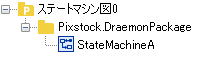
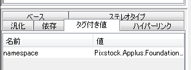
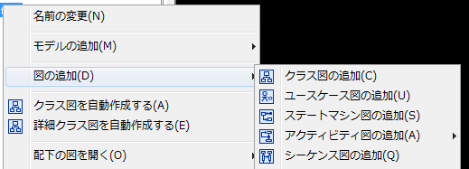
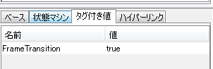
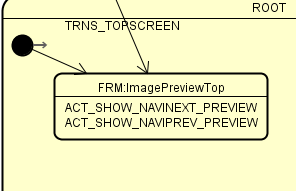

XMI2STM
============================


<!-- @import "[TOC]" {cmd="toc" depthFrom=1 depthTo=6 orderedList=false} -->

<!-- code_chunk_output -->

* [ビルド方法](#ビルド方法)
	* [開発ビルド](#開発ビルド)
	* [プロダクションビルド](#プロダクションビルド)
* [使用方法](#使用方法)
	* [サンプル状態遷移図](#サンプル状態遷移図)
* [状態遷移図の作成方法](#状態遷移図の作成方法)
	* [状態遷移図](#状態遷移図)
	* [名前空間の指定方法](#名前空間の指定方法)
	* [ステートマシン図の追加方法](#ステートマシン図の追加方法)
	* [画面状態遷移ワークフローの作成方法](#画面状態遷移ワークフローの作成方法)
		* [画面制御状態](#画面制御状態)
* [実装](#実装)
	* [画面遷移状態アクティビティ](#画面遷移状態アクティビティ)

<!-- /code_chunk_output -->


# ビルド方法

## 開発ビルド

`Xmi2Stm.sproj`があるフォルダで下記コマンドを実行します。

```
$ dotnet build
```

## プロダクションビルド

`Xmi2Stm.sproj`があるフォルダで下記コマンドを実行します。

```
$ dotnet publish -c Release -f netcoreapp2.0 -r linux-x64
$ dotnet publish -c Release -f netcoreapp2.0 -r win7-x64
```

# 使用方法

```
Xmi2Stm.exe <XMIファイルパス>
```

outputフォルダが生成され、ワークフローソースコードファイルが作成されます。

## サンプル状態遷移図

`assets`には、アプリケーションの動作確認用のサンプルファイルを格納しています。

- Sample.asta
    - 状態遷移図を含むastahファイルです。
- Sample.xml
    - `Sample.asta`からエクスポートしたXMI形式のファイルです。
      このファイルをXmi2Stm.exeへ読み込みます。

Sample.astaには3つのパッケージが含まれています。
それぞれ1つ以上の状態遷移図を含みます。

- Pixstock.ContentBrowser
    - CategoryTree画面状態遷移
    - ContentBrowser画面状態遷移
- Pixstock.Core
    - 01マスターコントロール
	- 02サービスインターフェース
	- 03データアクセス
- Pixstock.Preview
	- ImagrePreview画面状態遷移

各状態遷移図が、ワークフローソースコードファイルを生成します。
生成するソースファイル名は、状態遷移図の`状態マシン名`プロパティとなります。

|状態遷移図|ファイル名|
|---------|---------|
|CategoryTree画面状態遷移|Pixstock.ContentBrowser.CategoryTreeTransitionWorkflow.cs|
|ContentBrowser画面状態遷移|Pixstock.ContentBrowser.ContentBrowserTransitionWorkflow.cs|
|01マスターコントロール|Pixstock.Core.MasterControlWorkflow.cs|
|02サービスインターフェース|Pixstock.Core.ServiceInterfaceWorkflow.cs|
|03データアクセス|Pixstock.Core.DataAccessControlWorkflow.cs|
|ImagrePreview画面状態遷移|Pixstock.Preview.ImagrePreviewTransitionWorkflow.cs|


# 状態遷移図の作成方法

    詳しくはSample.astaファイルを参照してください。

## 状態遷移図

Astahを使用し、状態遷移図を作成する。

> 図中の「ステートマシン図0」は、astahファイル名です。
> astahファイル名に規定はありません。



ルート階層配下に、「パッケージ」→「状態遷移図」という構造で作成する。

このパッケージ(`Pixstock.DraemonPackage`)内には、複数の状態遷移図を定義できる。
Pixstockでは、「UMLのパッケージ＝Pixstockのファウンデーション」という位置づけとする。

1つのファウンデーションで、複数の状態遷移図を定義できる。

## 名前空間の指定方法

パッケージを作成し、タグ付き値にnamespaceを指定します。



## ステートマシン図の追加方法

ワークフローは、ステートマシン図に記述します。
作成したステートマシン図の「状態マシン名」が、ツールにより生成される際のクラス名となります。



## 画面状態遷移ワークフローの作成方法

画面状態遷移ワークフローとしたいステートマシン図を選択し、「タグ付き値」に下記の設定を行います。

```
FrameTransition=true
```


### 画面制御状態

画面状態遷移ワークフローでは、図中のアクティビティに画面制御状態を設定することで画面を制御するロジックとのマッピングが行われ、自動的に画面の表示／非表示処理が追加されます。

画面制御状態を設定するには、下記図のように状態名に「FRM:<コンテナ名＞」を付与します。
「コンテナ名」は自動的にプリフィックス（Pixstock.Applus.Containers.）が付与された状態でソースコードが生成されます。




# 実装

フレームワーク内での特殊なイベント処理以外は、状態遷移で処理するイベントハンドラはasync非同期処理で行われます。Fireメソッドの呼び出し元では、awaitによりイベント処理の完了を待つことができます。

一方、フレームワークはコンテントの切り替えで発生するイベント処理の完了は待ちません。
これは、コンテント切替イベントが完了していないにも関わらず、フレームワークが管理するコンテントの状態が切り替わる事を意味しており、コンテント状態と切替イベントの呼び出しタイミングは同期していないため注意が必要です。

## 画面遷移状態アクティビティ

自動的にEntryとExitのメソッドがコードに追加されます。
これらのメソッド名は`__FTC_Event_<アクティビティ名>_Entry`および`__FTC_Event_<アクティビティ名>_Exit`となります。

このメソッドには、内部処理が自動生成されておりプログラマがこのメソッドに任意の処理を追加することはできません。